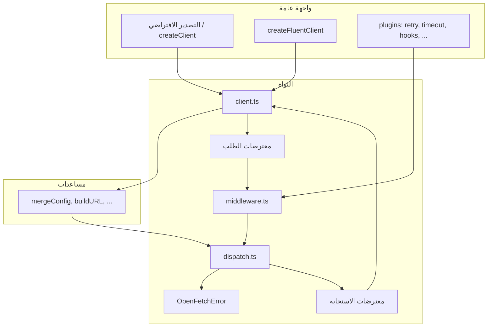
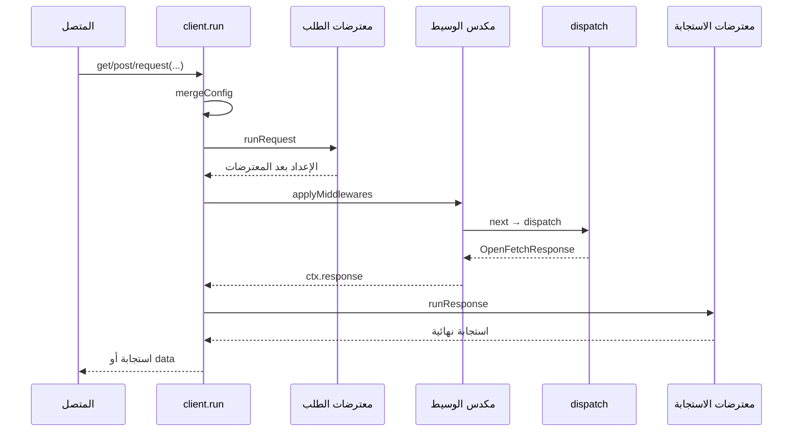

# البنية والداخلية

هذه الصفحة تجمع **رسمًا معماريًا**، **مقارنة دقيقة مع Axios من الداخل**، **مراجعة تصميم**، و**شرحًا مجمّعًا** لملفي `retry.ts` و`cache.ts` (حسب نطاقات الأسطر لتبقى قابلة للقراءة).

للاستخدام اليومي ابدأ من [البدء](./getting-started.md) و[المعترضات والوسيط](./interceptors-middleware.md).

## الاتجاه الذي ننصح به

لو حابب **ملف واحد** يغطي كل ما طلبته سابقًا: اعتمد هذه الصفحة. شرح «سطرًا بسطر» كامل لـ 300 سطر يكون مربكًا في المتصفح؛ لذلك نشرح **كل مجموعة أسطر** ووظيفتها — وهو ما يعادل الشرح السطر بسطر منطقيًا.

## طبقات المعمارية

openFetch رقيقة بقصد: **نقل واحد** (`fetch`)، **عميل** يدمج الإعدادات ويشغّل السلاسل، **وسيط** يلفّ `next()` (إعادة محاولة، تخزين مؤقت، تسجيل)، و**dispatch** ينفّذ الاستدعاء ويحلّل الجسم.

## دورة حياة الطلب

**إعادة المحاولة** و**التخزين المؤقت** وسيطان: يجلسان حول `next()` فيمكنهما إعادة استدعائه أو تخطيه.

---

## openFetch مقابل Axios — من الداخل

| الموضوع | openFetch | Axios |
|---------|-----------|--------|
| **النقل الأساسي** | دائمًا **`fetch`** لواجهة الجلب القياسية. | **محوّل (adapter)**؛ المتصفح غالبًا **XMLHttpRequest**؛ Node **`http`/`https`**. |
| **تبديل المحوّل** | غير مدعوم بالتصميم. | **adapter** مخصص خيار رسمي. |
| **المسار في النواة** | **وسيط** حول `next()` ثم **`dispatch`** (استدعاء `fetch` واحد). | سلاسل **معترضات** + **`dispatchRequest`** → المحوّل. |
| **تقدم الرفع (XHR)** | لا يوجد XHR؛ يتبع قدرات **fetch**. | محوّل XHR يدعم غالبًا **progress** للرفع/التنزيل. |
| **إعادة التوجيه** | خيار **`redirect`** الخاص بـ fetch؛ إضافة `strictFetch()` تضبط `error` عند عدم التحديد. | يعتمد على المحوّل/البيئة. |
| **الإلغاء** | **`AbortSignal`** | **`signal`** وقديمًا **CancelToken**. |
| **التبعيات** | تصميم بلا تبعيات وقت التشغيل للنواة. | حزمة أوسع وسلوك مزدوج Node/متصفح. |
| **تفسير الجسم** | في **`dispatch.ts`** بشكل مركزي. | تحويلات ومسار axios. |
| **الأخطاء** | **`OpenFetchError`** مع **`code`** و`toShape()`. | **`AxiosError`**. |

---

## مراجعة تصميم

### نقاط قوة

- نقل واحد يسهّل Workers وSSR والحافة.
- فصل **وسيط / معترضات** واضح.
- ميزانية إجمالية لإعادة المحاولة بساعة **monotonic**.
- توثيق **vary** للتخزين المؤقت و**assertSafeHttpUrl** يعكس وعيًا أمنيًا.

### نقاط ضعف / مقايضات

1. لا طبقة محوّلات — حالات نادرة تحتاج XHR لا تُغطى هنا.
2. **ترتيب الوسيط** حساس؛ الخطأ سلوكي وليس خطأ TypeScript.
3. **إعادة التحقق في الخلفية** في `cache.ts` تستدعي **`dispatch` مباشرة** فتتجاوز مكدس الوسيط الكامل للعميل (مقصود لتفادي التكرار، لكن قد يفوت تسجيل/تحديث توكن إن كان في الوسيط فقط).
4. **`defaults` القابلة للتعديل** قد تفاجئ إن شاركت مراجعًا.
5. قيود **fetch** تنطبق بالكامل (تقدم، إعادة توجيه، …).

### تحسينات محتملة

- تحذيرات **تطوير** عند ترتيب وسيط مشبوه.
- خيار لفتح **إعادة التحقق الخلفية** على جزء من الوسيط.
- وسيط **دمج الطلبات الجارية** (coalescing) اختياري.

---

## `retry.ts` — شرح الملف حسب الأسطر

| الأسطر | الوظيفة |
|--------|---------|
| 1–14 | استيرادات وأنواع و`OpenFetchError`. |
| 16 | حالات HTTP الافتراضية لإعادة المحاولة. |
| 18–25 | وقت أحادي **monotonic** للميزانية الإجمالية. |
| 27–29 | `sleep`. |
| 31–60 | `sleepBackoff` مع إنهاء مبكر عند إلغاء الإشارة → `ERR_CANCELED`. |
| 62–104 | دمج الخيارات الافتراضية مع `ctx.retry`. |
| 106–119 | ترويسة **Idempotency-Key** تلقائية لـ POST عند السماح بإعادة محاولة غير آمنة. |
| 121–140 | طرق «آمنة» للإعادة وبناء URL للأخطاء. |
| 146–176 | إلغاء خارجي فوري؛ تجاوز موعد إعادة المحاولة `ERR_RETRY_TIMEOUT`. |
| 178–199 | `builtinShouldRetry`: قرار إعادة المحاولة حسب `code` والسياسة. |
| 218–300 | الحلقة: محاولات، دمج **إشارة الموعد النهائي** مع إشارة المستخدم، `next()`، ثم backoff مع احترام الموعد. |

---

## `cache.ts` — شرح الملف حسب الأسطر

| الأسطر | الوظيفة |
|--------|---------|
| 5–44 | `MemoryCacheEntry` و`MemoryCacheStore` مع طرد FIFO عند `maxEntries`. |
| 46–89 | خيارات الوسيط، استنساخ ضحل للاستجابة، **`appendCacheKeyVaryHeaders`**. |
| 91–123 | **`revalidateInBackground`**: `dispatch` مع `memoryCache.skip` — لا يمر بمكدس الوسيط الكامل. |
| 130–202 | وسيط: تخطي عند `skip`؛ مفتاح التخزين؛ ضربة طازجة تعيد من الذاكرة؛ منطقة stale مع SWR اختياري؛ بعد `next()` يخزن الاستجابة. |

---

## قراءة ذات صلة

- [الإضافات والواجهة السلسة](./plugins-fluent.md)  
- [المعترضات والوسيط](./interceptors-middleware.md)  
- [إعادة المحاولة والتخزين المؤقت](./retry-cache.md)  
- [الأخطاء والأمان](./errors-security.md)  
