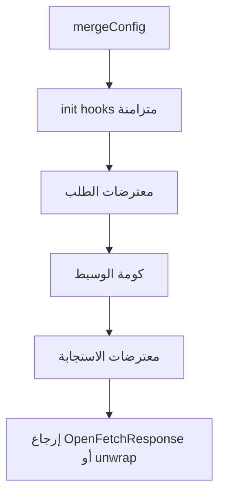
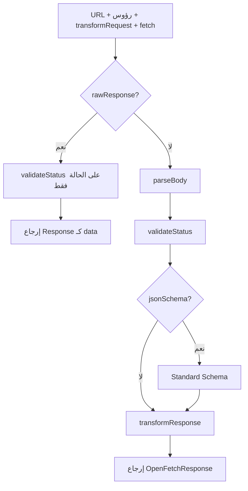

# الميزات ومسار الطلب الكامل

صفحة مرجعية: **ما يوفّره openFetch** و**ترتيب التنفيذ** من دمج الإعداد حتى إرجاع الاستجابة (بعد آخر التعديلات على الحزمة).

للمقارنات المعمّقة راجع [البنية والداخلية](./architecture.md). لجدول الخيارات راجع [الإعدادات](./configuration.md). النسخة الإنجليزية الكاملة: [Features & pipeline](../features-pipeline.md).

## نظرة على الحزمة

| الموضوع | التفاصيل |
|---------|----------|
| **npm** | `@hamdymohamedak/openfetch` |
| **التنسيق** | ESM فقط |
| **اعتماديات التشغيل** | صفر |
| **المحركات** | Node 18+ والمتصفحات وBun وDeno وWorkers |
| **نقاط الدخول** | الحزمة الرئيسية؛ `/plugins`؛ `/sugar` |
| **النقل** | `fetch` الأصلي فقط |

---

## قائمة الميزات

### العميل والإعداد

- **`createClient` / `create`** — افتراضيات، أوامر HTTP، `request`، `use`.
- **`mergeConfig`** — دمج افتراضيات + استدعاء؛ دمج رؤوس؛ **سلسلة** للـ `middlewares` و`transformRequest` و`transformResponse` و**`init`**؛ دمج مركّب لـ **`retry.onBeforeRetry` / `onAfterResponse`**؛ دمج سطحي لـ `retry` و`memoryCache`.
- **`init`** — مصفوفة دوال **متزامنة** على الإعداد المدمج **قبل** المعترضات (تعديل رؤوس، إلخ).
- **`Request` كمدخل** — `client.request(request, تجاوزات?)` يدمج عنوان الطلب والطريقة والرؤوس والجسم والإشارة مع الافتراضيات.
- **`throwHttpErrors`** — سلوك قريب من Ky عند عدم وجود **`validateStatus`**: `false` لا يرمي على حالة HTTP؛ دالة ترجع `true` تعني «ارمِ خطأ HTTP لهذه الحالة». إن وُجد **`validateStatus`** فهو **يغلب** `throwHttpErrors`.

### المعترضات والوسيط

- **معترضات الطلب** — تسلسل غير متزامن (LIFO).
- **معترضات الاستجابة** — تسلسل غير متزامن (FIFO).
- **الوسيط** — حول `next()` حتى يصل الطلب إلى **`dispatch`** (استدعاء `fetch` الفعلي).

### `dispatch` (النقل)

- بناء URL، **`assertSafeUrl`** اختياري، رؤوس، **`Accept`** مقترح عند **`responseType`**، مصادقة Basic، **`transformRequest`**، ثم **`fetch`**.
- **`timeout`** — مع تمييز **`ERR_TIMEOUT`** عن إلغاء المستخدم **`ERR_CANCELED`** عندما يكون الإلغاء من المهلة الداخلية فقط.
- **`rawResponse`** — تخطي التحليل و`transformResponse`؛ `data` هي `Response` الأصلية.

### بعد `fetch` (المسار العادي)

1. **تحليل الجسم**
2. **`validateStatus`** — فشل → `ERR_BAD_RESPONSE` (مع الجسم المحلّل إن وُجد)
3. **`jsonSchema`** — تحقق Standard Schema اختياري؛ فشل → **`SchemaValidationError`**
4. **`transformResponse`**

### إعادة المحاولة

- backoff، حالات HTTP، الشبكة، مفتاح **Idempotency** لـ POST عند التفعيل، ميزانية زمنية أحادية **`timeoutTotalMs`**.
- **`onAfterResponse`** — بعد نجاح المحاولة؛ رمي **`OpenFetchForceRetry`** يعيد المحاولة.
- **`onBeforeRetry`** — بعد فشل محاولة وقبل الانتظار (عند وجود محاولة لاحقة).
- **`hooks()`** — يدمج `onBeforeRetry` / `onAfterResponse` في `ctx.request.retry`.

### التخزين المؤقت والـ fluent

- وسيط ذاكرة للـ GET/HEAD مع TTL وSWR (انظر [إعادة المحاولة والتخزين المؤقت](./retry-cache.md)).
- الإضافات: `timeout`، `hooks`، `debug`، **`strictFetch`**.
- **Fluent**: `createFluentClient`، سلاسل مثل `.json()` و**`.json(schema)`**، **`.memo()`**.

### الأخطاء والمساعدات

- **`OpenFetchError`** + **`toShape()`** للسجلات الآمنة نسبياً.
- **`isOpenFetchError`**, **`isHTTPError`**, **`isTimeoutError`**, **`isSchemaValidationError`**.
- **`assertSafeHttpUrl`**, **`maskHeaderValues`**, **`redactSensitiveUrlQuery`**, مفاتيح idempotency، **`cloneResponse`**.

---

## الصورة الكاملة للـ pipeline (مخطط)



**داخل الوسيط (مثال `createRetryMiddleware`):** كل محاولة تنفّذ `await next()` فيمرّ الوسيط الداخلي ثم **`dispatch`**. عند النجاح يُستدعى **`onAfterResponse`**؛ إذا أُلقِي **`OpenFetchForceRetry`** تُعاد المحاولة. عند الفشل يُستدعى **`onBeforeRetry`** (إن وُجد) ثم الانتظار ثم المحاولة التالية إن سمحت السياسة.

### داخل `dispatch` (بعد `fetch` — ليس `rawResponse`)



### مخطط نصي (نسخ سريع)

```
mergeConfig
   ↓
init hooks (sync)
   ↓
request interceptors
   ↓
middleware stack
   ↓
   ┌─ retry: لكل محاولة → next → … → dispatch
   │     dispatch: URL/headers → transformRequest → fetch
   │       [raw?] validateStatus → return Response
   │       OR parse → validateStatus → jsonSchema? → transformResponse
   │     ↓
   │   onAfterResponse — رمي OpenFetchForceRetry؟ → حلقة المحاولة
   │     ↓
   └─ عند الفشل: onBeforeRetry → backoff → حلقة
   ↓
response interceptors
   ↓
return
```

**ملاحظات**

- **`onAfterResponse`** يعمل **بعد** اكتمال `dispatch` (بما فيه **`transformResponse`**)، فيرى `data` النهائية إلا في حالة **`rawResponse`**.
- الوسيط **فوق** retry يعمل **مرة واحدة** لكل استدعاء عميل؛ الوسيط **تحت** retry يعمل **مرة لكل محاولة**.

---

## روابط

- [الإعدادات](./configuration.md)  
- [المعترضات والوسيط](./interceptors-middleware.md)  
- [إعادة المحاولة والتخزين المؤقت](./retry-cache.md)  
- [الأخطاء والأمان](./errors-security.md)  
- [الإضافات والـ fluent](../plugins-fluent.md) (إنجليزي)  
