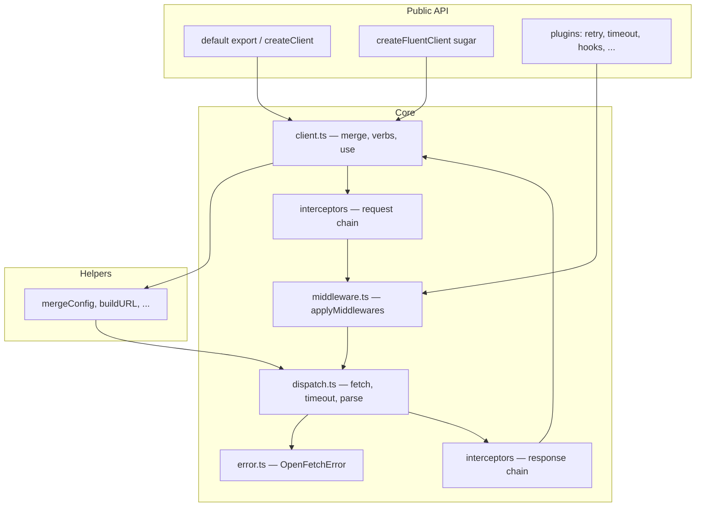

# Architecture & internals

This page is the **recommended “single home”** for how openFetch is put together: a **request/response diagram**, a **precise comparison to Axios internals**, a short **design review**, and **annotated walkthroughs** of `retry.ts` and `cache.ts` (grouped by line ranges for readability).

For day-to-day usage, start with [Getting started](./getting-started.md) and [Interceptors & middleware](./interceptors-middleware.md).

## Layered architecture

openFetch is intentionally thin: **one transport** (`fetch`), a **client** that merges config and runs hooks, **middleware** that can wrap `next()` (retries, cache, logging), and **dispatch** that performs the actual HTTP call and body parsing.



## Request lifecycle (one call)

```mermaid
sequenceDiagram
  participant U as Caller
  participant C as client.run
  participant RI as Request interceptors
  participant M as Middleware stack
  participant D as dispatch (fetch)
  participant V as Response interceptors

  U->>C: get/post/request(...)
  C->>C: mergeConfig(defaults, call)
  C->>RI: runRequest(merged)
  RI-->>C: afterRequest config
  C->>M: applyMiddlewares(ctx, inner)
  Note over M: Outer middleware runs first; inner calls next()
  M->>D: inner: dispatch(cfg)
  D->>D: transformRequest, fetch, parse, validateStatus
  D-->>M: OpenFetchResponse
  M-->>C: ctx.response
  C->>V: runResponse(response)
  V-->>C: final response
  C-->>U: OpenFetchResponse or data if unwrapResponse
```

**Retry** and **cache** are middleware: they sit *around* `next()`, so they can call `next()` multiple times (retry) or skip it (cache hit).

---

## openFetch vs Axios — internal comparison

Both libraries expose a familiar **instance + defaults + interceptors** DX. Internally they diverge in **transport**, **pipeline shape**, and **extensibility**.

| Topic | openFetch | Axios |
|--------|-----------|--------|
| **Primary transport** | Always the runtime’s **`fetch`** (Web Fetch API). No second backend in core. | **Adapter** abstraction: browsers typically use **XMLHttpRequest**; Node uses **`http` / `https`** (or environment-specific builds). Not fetch-first. |
| **Adapter swapping** | No pluggable “HTTP backend” — by design. | **Custom adapters** are a first-class extension point (`adapter` config). |
| **Core pipeline** | **Middleware** composes around `next()` → **`dispatch`** (single place that calls `fetch`). **Interceptors** mutate config / response objects. | **Interceptor** chains + internal **`dispatchRequest`** → **adapter**. Transforms (`transformRequest` / `transformResponse`) are part of the axios pipeline. |
| **XHR-specific behavior** | None (no `onuploadprogress` from XHR; upload progress follows **fetch** / runtime capabilities). | XHR adapter supports **upload/download progress** events on typical browser setups. |
| **Redirects** | Uses **`fetch`’s `redirect`** option (`follow`, `manual`, `error`). `strictFetch()` plugin defaults to `error` when unset. | Follow behavior depends on adapter / environment (XHR vs Node); historically **follows redirects** by default in many setups. |
| **Cancellation** | **`AbortController` / `signal`** end-to-end. | **`signal`** (modern) plus legacy **CancelToken** in older code. |
| **Dependencies** | **Zero** runtime dependencies in the package design. | Axios ships as its **own package** with a larger surface area and Node/browser dual behavior. |
| **Body parsing** | Centralized in **`dispatch.ts`** (`parseBody`, `responseType`, JSON heuristic from `Content-Type`). | Axios **transforms** + default JSON parsing in the adapter/pipeline. |
| **Errors** | **`OpenFetchError`** with stable **`code`**, optional `toShape()` for logging. | **`AxiosError`** with `isAxiosError`, response/request/config attached. |

**When openFetch is a better fit:** you want **one mental model** (fetch everywhere: Workers, RSC, Edge, Node 18+), **small surface**, and **no XHR**.

**When Axios is a better fit:** you need **XHR-specific features** (e.g. upload progress in older browser stacks), **adapter replacement**, or you are already standardized on axios’s ecosystem.

---

## Design review — strengths, tradeoffs, improvements

### Strengths

- **Single transport** simplifies reasoning, testing, and edge deployment (Workers, SSR).
- **Middleware + interceptors** separation is clear: transforms vs cross-cutting concerns (retry, cache, logging).
- **Explicit ordering** is documented (retry vs timeout, cache vs retry).
- **Monotonic retry budget** avoids clock-skew issues for total timeout.
- **Optional SSRF-style URL guard** and **cache key vary headers** show security-aware defaults in docs and APIs.

### Tradeoffs / weaknesses

1. **No adapter layer** — you cannot swap in XHR or a custom HTTP stack without forking; that is intentional but limits rare use cases.
2. **Middleware order is easy to get wrong** — e.g. cache before vs after retry changes semantics materially; mitigated by documentation, not by static enforcement.
3. **In-memory cache background revalidation** calls **`dispatch` directly** (see [cache walkthrough](#cachets--annotated-source)). That **bypasses the full client middleware stack** for the refresh request — good for avoiding recursion, but means logging/auth refresh middleware on the client instance may not run on background fetches unless you duplicate logic inside `dispatch` transforms or use shared defaults carefully.
4. **`defaults` mutation** (`client.defaults`, pushing to `middlewares`) is flexible but can surprise in long-lived apps if shared references are mutated accidentally.
5. **Fetch limitations** apply wholesale (e.g. progress events, some redirect nuances) — not a bug, but a **platform** constraint.

### Possible improvements (ideas, not a roadmap)

- Optional **dev-only warnings** when middleware order looks suspicious (heuristic).
- Document or optionally wrap **background revalidation** so it can opt into a subset of middleware.
- **Request deduplication** (in-flight coalescing) as an optional middleware, distinct from cache.

---

## `retry.ts` — annotated source

Line numbers refer to **`src/core/retry.ts`** in the published **@hamdymohamedak/openfetch** package (see the GitHub repo linked from the site footer).

| Lines | What it does |
|-------|----------------|
| 1–14 | Imports: `buildURL`, idempotency helpers, `mergeAbortSignals`, types, `OpenFetchError`. |
| 16–16 | Default HTTP statuses to retry: **408, 429, 500, 502, 503, 504**. |
| 18–25 | **`monotonicNowMs()`** — uses `performance.now()` when available so **total retry budget** is not skewed by system clock changes. |
| 27–29 | **`sleep()`** — plain delay helper. |
| 31–60 | **`sleepBackoff()`** — waits for backoff but **stops early** if `request.signal` aborts; on abort sets `ctx.error` and rejects with **`ERR_CANCELED`**. |
| 62–76 | **`ResolvedRetry`** — internal shape after merging factory defaults + per-request `retry` options. |
| 78–83 | **`computeDelayMs()`** — exponential backoff with **jitter** (25% of capped delay). |
| 85–104 | **`resolveRetryOptions()`** — merges `ctx.retry` over factory defaults; fills defaults (`maxAttempts` 3, delays, flags). **`enforceTotalTimeout`** defaults to **true**. |
| 106–119 | **`applyPostIdempotencyKey()`** — if retrying non-idempotent methods, **`POST`** without an idempotency header gets a **generated stable key** (when `autoIdempotencyKey` is not false). |
| 121–125 | **`isSafeRetryMethod()`** — **GET, HEAD, OPTIONS, TRACE** are safe to retry without opt-in. |
| 127–130 | **`allowRetryForRequest()`** — either all methods (if `retryNonIdempotentMethods`) or only safe methods. |
| 132–140 | **`resolveRetryRequestUrl()`** — resolves URL string for error metadata via `buildURL`. |
| 146–156 | **`throwIfExternalAborted()`** — if user already aborted, **fail immediately** with `ERR_CANCELED` (no further attempts). |
| 158–166 | **`throwRetryDeadlineExceeded()`** — **`ERR_RETRY_TIMEOUT`** when total budget exceeded. |
| 168–176 | **`assertWithinRetryDeadline()`** — cheap check before work. |
| 178–199 | **`builtinShouldRetry()`** — interprets **`OpenFetchError`**: no retry on **`ERR_CANCELED`** / **`ERR_RETRY_TIMEOUT`**; **`ERR_BAD_RESPONSE`** retries if status is in `retryOnStatus` and method policy allows; **`ERR_NETWORK` / `ERR_PARSE`** if `retryOnNetworkError` and method policy allows. Unknown errors: optional network retry. |
| 218–300 | **`createRetryMiddleware()`** — main loop: increment **`attempt`**, check external abort + deadline, optionally set **`timeoutPerAttemptMs`** on `ctx.request`, apply POST idempotency header, then either **simple `await next()`** (no total deadline) or **merge deadline `AbortSignal`** with user signal so **in-flight fetch aborts** when total budget ends (`enforceTotalTimeout`). On success returns; on failure, if attempts exhausted rethrow; else **`builtinShouldRetry` × `shouldRetry`**, then **`sleepBackoff`** with delay capped by remaining monotonic budget, then loop. |

---

## `cache.ts` — annotated source

Same layout: **`src/core/cache.ts`** in the package source tree.

| Lines | What it does |
|-------|----------------|
| 5–9 | **`MemoryCacheEntry`**: stores **`OpenFetchResponse`**, **`freshUntil`**, **`expireAt`** (TTL + optional stale window). |
| 11–44 | **`MemoryCacheStore`**: **`Map`** with **FIFO eviction** when **`maxEntries`** (default 500) exceeded — deletes **oldest insertion order** key. |
| 46–60 | **`CacheMiddlewareOptions`**: TTL, **stale-while-revalidate**, allowed **methods** (default GET/HEAD), custom **`key`**, **`varyHeaderNames`** for auth-sensitive keys. |
| 62–68 | **`shallowCloneResponse()`** — copies response envelope; **`data`** shared by reference (acceptable for immutable cached payloads; be careful if callers mutate `data`). |
| 71–89 | **`appendCacheKeyVaryHeaders()`** — appends **unit-separator**–joined header slices so **different Authorization/Cookie** → different cache entries. |
| 91–123 | **`revalidateInBackground()`** — if not already inflight, runs **`dispatch({ ...request, memoryCache: { skip: true } })`** to refresh; on success updates store with new **`freshUntil` / `expireAt`**. Failures are swallowed (stale entry remains until **`expireAt`**). **Note:** this path uses **`dispatch` only**, not the full middleware stack. |
| 130–202 | **`createCacheMiddleware()`** — if **`memoryCache.skip`**, forwards **`next()`**. If method not allowed, **`next()`**. Builds **`rawKey`** (`METHOD url` or custom), then **`appendCacheKeyVaryHeaders`**. On **fresh hit** (`now < freshUntil`): set **`ctx.response`** clone, return. On **stale but not expired** (`now < expireAt`): serve clone; if **SWR > 0**, start **background revalidation**. On miss: **`await next()`**; if error or no response, return; else **store** shallow clone with TTL/SWR windows. |

---

## Related reading

- [Plugins & fluent API](./plugins-fluent.md) — subpath imports, plugin stack, fluent client  
- [Interceptors & middleware](./interceptors-middleware.md) — order and mental model  
- [Retry & cache](./retry-cache.md) — user-facing options and examples  
- [Errors & security](./errors-security.md) — logging and URL safety  
