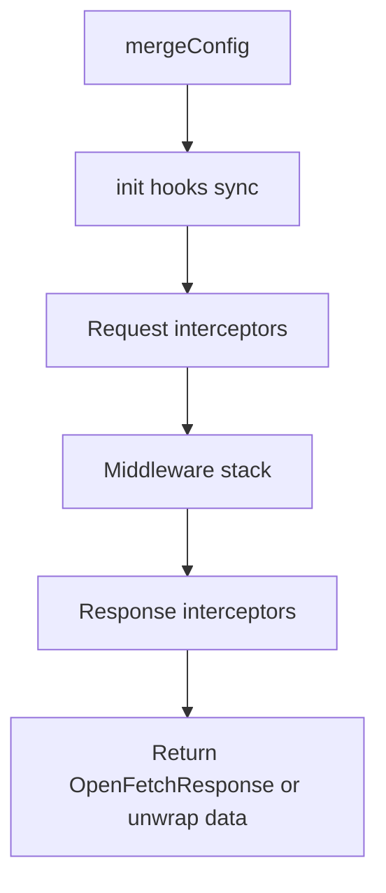
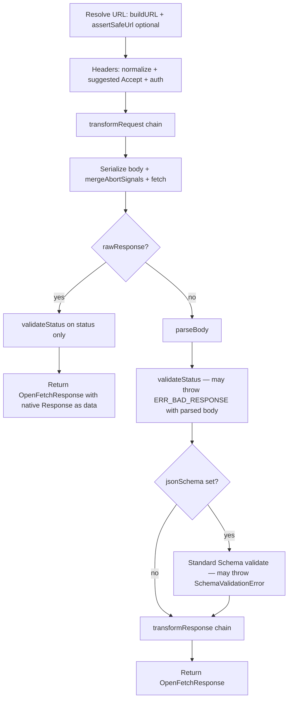

# Features & request pipeline

This page lists **what openFetch ships today** and shows the **end-to-end request pipeline** after merging config, lifecycle hooks, middleware (including retry), and `dispatch` internals.

For stack comparisons and deep dives, see [Architecture & internals](./architecture.md). For option-by-option reference, see [Configuration](./configuration.md).

## Package overview

| Topic | Detail |
|--------|--------|
| **npm** | [`@hamdymohamedak/openfetch`](https://www.npmjs.com/package/@hamdymohamedak/openfetch) |
| **Module format** | **ESM only** (`"type": "module"`) |
| **Runtime deps** | **Zero** |
| **Engines** | Node **18+**; also browsers, Bun, Deno, Cloudflare Workers, and other fetch-capable edges |
| **Entrypoints** | Main package; **`/plugins`** (retry, timeout, hooks, debug, strictFetch); **`/sugar`** (`createFluentClient`) |
| **Transport** | Native **`fetch`** only (no XHR adapter) |

---

## Feature inventory

### Client & config

- **`createClient` / `create`** — instance with `defaults`, HTTP verb helpers, `request()`, `use(middleware)`.
- **`mergeConfig`** — merges defaults + per-call: shallow top-level keys; **concatenates** `middlewares`, `transformRequest`, `transformResponse`, **`init`**; composes **`retry.onBeforeRetry` / `retry.onAfterResponse`**; shallow-merge for `retry` / `memoryCache`; shallow **`headers`**; strips prototype-pollution keys.
- **`init`** — synchronous callbacks on the **merged** config before interceptors (mutate headers, URL-related fields, etc.).
- **Native `Request` input** — `client.request(request, overrides?)` merges `Request` URL, method, headers, body, signal, and `RequestInit` passthrough fields with defaults and overrides.
- **`throwHttpErrors`** — Ky-style optional gate when **`validateStatus`** is omitted: `false` never throws on HTTP status; function `(status) => true` means “throw for this status”. If **`validateStatus`** is set, it **wins** and `throwHttpErrors` is ignored.

### Interceptors & middleware

- **Request interceptors** — async chain on config (LIFO order).
- **Response interceptors** — async chain on `OpenFetchResponse` (FIFO order).
- **Middleware** — `(ctx, next) => Promise<void>` around the inner `next()` that eventually calls **`dispatch`**; only the innermost `next` invokes **`fetch`**.

### Transport (`dispatch`)

- **URL** — `buildURL` with `baseURL`, `params`, optional **`assertSafeUrl`** (SSRF-style guard; not a full egress firewall).
- **Headers** — normalized to lowercase keys; optional **`auth`** (Basic); suggested **`Accept`** when **`responseType`** is set and `accept` is absent (`application/json` for `json`, etc.).
- **`transformRequest`** — ordered `(data, headers) => …` before body serialization.
- **Body** — JSON default for plain objects; respects `FormData`, `Blob`, etc.
- **`timeout`** — internal `AbortController` merged with **`signal`**; on timeout alone → **`OpenFetchError`** code **`ERR_TIMEOUT`** (user abort on `config.signal` → **`ERR_CANCELED`**).
- **`fetch`** — single call with merged `RequestInit` fields.
- **`rawResponse`** — skip parse + **`transformResponse`**; `data` is native **`Response`** (interceptors still run).

### After `fetch` (normal path, not `rawResponse`)

1. **Parse body** — by `responseType` or `Content-Type` heuristic.
2. **`validateStatus`** — failure → **`ERR_BAD_RESPONSE`** with parsed body attached when applicable.
3. **`jsonSchema`** — optional [Standard Schema](https://github.com/standard-schema/standard-schema) validation of parsed JSON; failure → **`SchemaValidationError`** (not an `OpenFetchError`).
4. **`transformResponse`** — ordered transforms on successful pipeline.

### Retry (`createRetryMiddleware` / `retry()` plugin)

- Exponential backoff, jitter, status-based retry, network/parse retry rules, **POST idempotency key** when retrying non-idempotent methods (opt-in), **monotonic total budget** (`timeoutTotalMs`), per-attempt timeout override.
- **`retry.onBeforeRetry`** — after a failed attempt, before backoff (when another attempt may run).
- **`retry.onAfterResponse`** — after a **successful** inner round-trip produced `ctx.response`; throw **`OpenFetchForceRetry`** to force another attempt (handled inside the retry loop).
- **`hooks()` plugin** — can set **`onBeforeRetry` / `onAfterResponse`**; they are **merged** into `ctx.request.retry` with any existing handlers.

### Cache, plugins, fluent

- **Memory cache middleware** — TTL, stale-while-revalidate, vary headers on cache key (see [Retry & cache](./retry-cache.md)).
- **Plugins** — `timeout`, `hooks`, `debug`, **`strictFetch`** (stricter redirect default when unset).
- **Fluent** — `createFluentClient` → `fluent(url).get().json()` / `.text()` / `.send()` / `.raw()` / **`.json(schema)`** (Standard Schema), optional **`.memo()`** for one buffered round-trip.

### Errors & utilities

- **`OpenFetchError`** with **`code`**, optional `response`, `toShape()` / `toJSON()` for safer logs (redacts URL query by default).
- **Guards** — `isOpenFetchError`, **`isHTTPError`**, **`isTimeoutError`**, **`isSchemaValidationError`**.
- **Utilities** — `assertSafeHttpUrl`, `maskHeaderValues`, `redactSensitiveUrlQuery`, idempotency helpers, `cloneResponse`.

---

## Full pipeline (one client call)

High level: **merge → init → request interceptors → middleware stack (often retry wraps inner) → dispatch → response interceptors → return**.



**Inside middleware** (when `createRetryMiddleware` is registered): each **attempt** runs `await next()` so inner middleware + **`dispatch`** execute once per try. On success, **`retry.onAfterResponse`** runs; if it throws **`OpenFetchForceRetry`**, the attempt is treated as retryable and the loop continues. On failure, **`retry.onBeforeRetry`** may run, then backoff, then the next attempt if policy allows.

### Inside `dispatch` (each successful `fetch` for non-`rawResponse`)

Order is fixed in source (`openFetch/src/transport/dispatch.ts`):



### ASCII (quick copy)

```
mergeConfig (defaults + per-call, Request merged if used)
   ↓
init[] (sync, mutate merged config)
   ↓
request interceptors (async, LIFO)
   ↓
middleware stack (outer first)
   ↓
   ┌─ retry middleware (if registered): loop attempts
   │     ↓
   │   inner middleware…
   │     ↓
   │   dispatch: URL → headers → transformRequest → fetch
   │     ↓
   │   [raw?] validateStatus → return Response as data
   │     OR
   │   parse body → validateStatus → jsonSchema? → transformResponse
   │     ↓
   │   onAfterResponse (retry hook) — throw OpenFetchForceRetry? → loop
   │     ↓
   └─ (on failure before next attempt) onBeforeRetry → backoff → loop
   ↓
response interceptors (async, FIFO)
   ↓
return (unwrap data if unwrapResponse)
```

**Notes**

- **`onAfterResponse`** runs **after** `dispatch` has returned a full **`OpenFetchResponse`** (including **`transformResponse`**), so the hook sees **final** `data` unless you use **`rawResponse`** (then `data` is still the native **`Response`**).
- **Force retry** is implemented by throwing **`OpenFetchForceRetry`** from **`onAfterResponse`**; the retry middleware treats it like a retryable failure and runs **`onBeforeRetry`** before backoff when applicable.
- Middleware **above** retry in the stack runs **once per outer client call**; middleware **below** retry runs **once per attempt**.

---

## Related docs

- [Configuration](./configuration.md) — every `OpenFetchConfig` field  
- [Interceptors & middleware](./interceptors-middleware.md) — ordering mental model  
- [Retry & cache](./retry-cache.md) — retry options and cache semantics  
- [Errors & security](./errors-security.md) — codes, guards, logging  
- [Plugins & fluent API](./plugins-fluent.md) — subpath imports  
